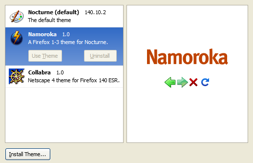

# userChrome Manager
userChrome Manager is a easy to use theme manager for multiple userChrome themes for  Firefox **(115 - latest)**.

## Compatibility
userChrome Manager has been tested with the following platforms:
- Windows 10 with [Nocturne](https://github.com/raytek-cafe/Nocturne) by reytek.cafe

Compatibility with other Firefox forks, platforms, or versions has not been confirmed.

## Features
- Enabling and disabling themes with a options page
- Easily install themes themes through `.zip` files
- Version and browser compatibility checks

## Installation
_**To begin, download userChrome Manager from [the releases page](https://github.com/travy-patty/userchrome-manager/releases/latest)**_
### Windows
1. On Firefox, open the `about:support` page
2. Look for Profile Folder under Application Basics and press the `Open Folder` button
3. Copy the `chrome` folder inside of `Profile Folder` to the directory of your profile that opened
4. In your Firefox installation folder*, copy the contents of the `Browser Folder` to the directory of the Firefox installation. (You may need administrator privileges to perform this step.)
5. Go back to your Firefox window, and press `Clear startup cache` followed by confirming the prompt that displays.

*You can find your Firefox installation folder by finding a Firefox shortcut, right-click it, and select `Open file location`

## Usage
To use a userChrome theme such as [Namoroka](https://github.com/echelon-theme/namoroka/), do the following steps:

1. Download the theme's release `.zip` file.
2. On Firefox, open userChrome Options by going to **View** > **Apply Theme** > **Manage Themes** in the Menu Bar, or go to `about:userchrome` page.
3. Press the `Install Theme...` button on the bottom left of the page.
4. Select the `.zip` file in the file picker.
5. Press the `Restart Firefox` link on the selected theme when prompted.
6. You are now using your theme - enjoy!

## Development
To create a theme for userChrome Manager, see the [wiki](https://github.com/travy-patty/userchrome-manager/wiki).